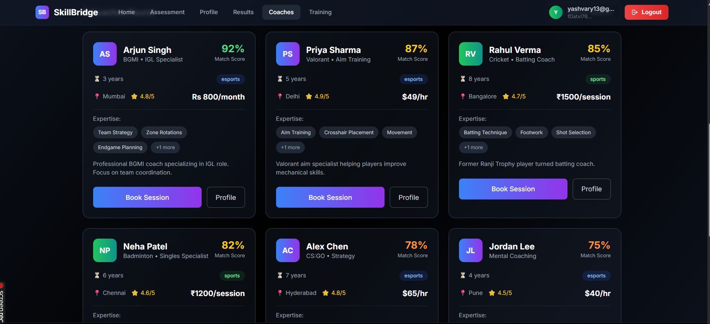

# SkillBridge 
*AI-Powered Skill Assessment & Coach Matching Platform*

SkillBridge is an AI-driven MVP built during *AIBoomi Startup Weekend* that helps *sports and esports athletes* reduce confusion in training by providing *structured skill assessment, intelligent coach matching, and personalized growth guidance*.

The platform currently supports (more in near future):
- *Esports:* BGMI, Valorant  
- *Sports:* Cricket, Football  

---

##  Problem Statement

Aspiring athletes and esports players face:
- Fragmented learning paths  
- Unverified or mismatched coaching  
- Lack of clarity on what to improve next  
- No structured, explainable assessment of skills  

Existing platforms focus on *content, not **guided progression*.

---

##  Solution Overview

SkillBridge introduces a *unified AI-driven coaching ecosystem* that:

1. Assesses players across *10 structured skill parameters*
2. Interprets results using an *AI Skill Assessment Knowledge Base*
3. Matches users with *relevant coaches* using AI reasoning
4. Generates *clear, realistic improvement guidance*

This removes guesswork and brings *clarity, trust, and structure* to athlete development.

---
## images



---

##  How AI Is Used (Explainable & Ethical)

SkillBridge uses *Large Language Models (LLMs)* as a *reasoning engine*, not for prediction or training.

AI is used to:
- Interpret assessment inputs using a *Skill Assessment Knowledge Base*
- Retrieve suitable coaches from a *synthetic but realistic coach database*
- Reason over player needs, goals, and constraints
- Generate *explainable recommendations*

 No custom ML model training or fine-tuning was performed.

---

##  Skill Assessment Framework (10 Parameters)

Each user is assessed on the following parameters:

1. Competitive Level  
2. Role / Position / Playstyle  
3. Experience Duration  
4. Performance Output  
5. Consistency  
6. Strength Area  
7. Weakness Area  
8. Game Sense / Tactical Awareness  
9. Time Commitment  
10. Intent & Mindset  

This framework works consistently across *sports and esports*.

---

##  AI Reasoning Flow

```text
User Assessment Inputs
        ↓
google embedding 001 (RAG)
        ↓
vector search for top 3 best match (RAG)
        ↓
sends to LLM (gemini 2.5 flash)
        ↓
Personalized Skill Summary and Reasoning
```

---

---

## TECH STACK

- Frontend : React.js
- Backend : Express.js, Node.js
- Styling : Tailwind CSS
- LLM : Gemini 2.5 Flash
- Embedding model : gemini embedding 001
- Authenticaion : Firebase
- Database : Firestore

---

## Impact in India

- **Access for All** – Bringing top-tier coaching to underserved regions
- **Earning Potential** – New income streams for coaches & creators
- **Shifting Sports Culture** – Empowering diverse sports and inclusivity

## Global Impact
- **Global Stage** – Enabling Indian athletes and gamers to rise globally
- **Skill Development**: Fostering education and critical thinking through immersive sports and esports learning.
- **Talent Hub India** – Building India’s reputation in global sports & gaming

---

